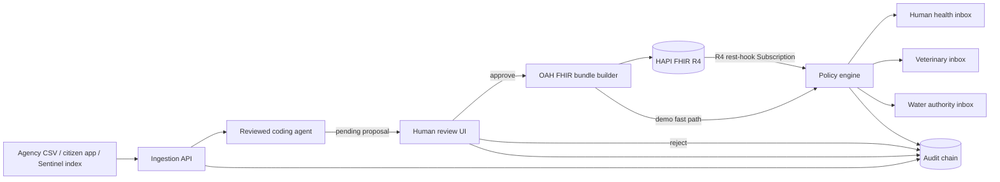

# AquaFHIR Bridge

AquaFHIR Bridge is a FHIR-native One Health data bus. It converts heterogeneous water and Earth-observation readings into reviewed [OneAquaHealth FHIR R4](https://build.fhir.org/ig/hl7-eu/oah/) resources, publishes them to a HAPI FHIR server, evaluates an explicit alert policy, and records each transformation in a tamper-evident audit chain.

This repository contains only the first concept from the source brief: **the One Health data bus and reviewed coding agent**. It does not include the separate BloomGuard prediction product or StreamSentinel symptom-surveillance concept.

> Status: detailed prototype boilerplate. It is suitable for a hackathon demonstration and engineering handoff, not clinical, veterinary, public-warning, or regulatory production use.

## What the system proves

The end-to-end slice is intentionally narrow:

1. Accept an agency, citizen, or satellite reading without discarding the original label or source.
2. Propose an OAH terminology code and normalize the unit to UCUM using curated rules.
3. Require a person to approve or reject the proposal. No confidence score bypasses review.
4. Build and validate an OAH `Location` and environmental `Observation` against their profiles.
5. Publish those resources plus the source `Organization` as one HAPI FHIR R4 transaction, or return them in dry-run mode.
6. Evaluate a versioned demonstration threshold policy and route any alert to human-health, veterinary, and/or water-authority audiences.
7. Hash-chain every proposal, decision, and alert so later modification is detectable.

The included Oder replay is synthetic demonstration data shaped around the 2022 incident narrative. It is not a scientifically reconstructed incident dataset, and the sample thresholds are not WFD/EQS limits.

## Architecture



The prototype keeps its review queue, alerts, and provenance in SQLite. HAPI uses PostgreSQL. That separation makes the boundary clear: FHIR is the interoperable record; workflow state is application state. See [architecture.md](docs/architecture.md) for component and sequence details.

## Quick start with Docker

Requirements: Docker Engine/Desktop with Compose v2.

```bash
cp .env.example .env
docker compose up --build
```

On PowerShell, use `Copy-Item .env.example .env` instead of `cp`.

Open:

- Dashboard: <http://localhost:8000>
- OpenAPI: <http://localhost:8000/docs>
- HAPI FHIR UI: <http://localhost:8080>
- HAPI FHIR base: <http://localhost:8080/fhir>

HAPI can take a minute or two on its first start while PostgreSQL initializes and the `hl7.eu.fhir.oah#0.1.0-ci-build` package is installed. The Compose image is pinned to HAPI `v8.10.0-3`; pin it by digest as well before a controlled deployment.

In the dashboard, choose **Replay Oder demo**, inspect each terminology proposal, and approve it. The last three readings cross the demonstration policy and create audience-specific alert cards. The header says `enabled` when writes go to HAPI and `dry-run` when only local FHIR resources are generated.

## Run the bridge locally

This path is faster for development and defaults to safe FHIR dry-run mode.

```bash
python -m venv .venv
# PowerShell: .venv\Scripts\Activate.ps1
# bash/zsh:  source .venv/bin/activate
python -m pip install -e ".[dev]"
cp .env.example .env
```

Edit `.env`:

```dotenv
DATABASE_PATH=aquafhir.db
FHIR_BASE_URL=http://localhost:8080/fhir
FHIR_WRITE_ENABLED=false
```

Then start and test:

```bash
uvicorn aquafhir.main:app --reload
pytest
ruff check .
```

## Try the API

Create a review proposal:

```bash
curl -X POST http://localhost:8000/api/v1/proposals \
  -H "Content-Type: application/json" \
  -d '{
    "source_id":"pl-agency-001",
    "source_type":"agency",
    "parameter":"EC",
    "value":2350,
    "unit":"uS/cm",
    "observed_at":"2022-07-27T08:00:00Z",
    "site_code":"oder-kostrzyn",
    "site_name":"Oder at Kostrzyn",
    "latitude":52.5887,
    "longitude":14.6495
  }'
```

The result remains `pending`, even for an exact match. Approve it with the returned ID:

```bash
curl -X POST http://localhost:8000/api/v1/proposals/PROPOSAL_ID/approve \
  -H "Content-Type: application/json" \
  -d '{"reviewer":"reviewer@example.org"}'
```

Inspect alerts and verify the audit chain:

```bash
curl http://localhost:8000/api/v1/alerts
curl http://localhost:8000/api/v1/provenance/verify
```

See [api.md](docs/api.md) for every endpoint and error contract.

## FHIR conformance choices

The current OAH continuous build is based on FHIR 4.0.1. Its environmental Observation profile requires:

- `status = final`;
- a code drawn preferably from the OAH non-health indicator value set;
- a `subject` referencing an OAH `Location`;
- an `effective[x]` time;
- at least one `performer`;
- a quantity or coded value.

The builder therefore creates all required surrounding resources, uses `http://unitsofmeasure.org` for quantity codes, and places this canonical profile URL in `Observation.meta.profile`:

```text
http://hl7.eu/fhir/ig/oah/StructureDefinition/observation-indicators-oah
```

The OAH IG currently carries environmental concepts such as `electrical-conductivity`, `dissolved-oxygen`, `waterTemperature`, and `ndci` in its temporary project code system. The scaffold uses those codes rather than inventing unsupported LOINC mappings. Add a second LOINC or SNOMED CT coding only after terminology review.

FHIR R4 Subscription filtering is search-based, not threshold-expression based. The supplied Subscription watches final Observations and sends an empty rest-hook notification; the bridge then queries HAPI for resources updated since its durable cursor and applies the versioned numerical policy. The approval pipeline also evaluates the same policy immediately to keep the demo deterministic.

## Human-in-the-loop coding agent

`ReviewedCodingAgent` is a deterministic and testable baseline, not a hidden claim that an LLM is already configured. It performs alias similarity, curated code selection, and explicit unit conversion. Its output contract is a `MappingProposal`.

To add an LLM safely:

1. Implement another proposer that returns the same proposal contract.
2. Ground it only in a versioned terminology catalog and include candidate evidence.
3. Reject unrecognized units instead of guessing.
4. Keep `requires_review=true`; the model must not call the FHIR publisher.
5. Store model/provider/version and prompt-template hash in the provenance payload.
6. Run profile validation and terminology tests after approval, before publication.

The curated starting vocabulary is in [coding-rules.yaml](config/coding-rules.yaml). Demonstration alert rules live separately in [thresholds.yaml](config/thresholds.yaml), which prevents terminology edits from silently changing safety policy.

## Repository map

```text
.
├── config/                    # reviewed terminology and demo alert policy
├── data/                      # transparent synthetic Oder replay CSV
├── docs/                      # architecture, API, demo, production notes
├── infra/hapi/               # HAPI R4 + OAH package configuration
├── src/aquafhir/
│   ├── coding.py             # proposal-only coding agent
│   ├── fhir.py               # conformant resources, bundles, subscriptions
│   ├── repository.py         # SQLite workflow state + hash chain
│   ├── service.py            # review-gated orchestration
│   ├── thresholds.py         # unit-aware versioned policy evaluation
│   ├── main.py               # FastAPI surface
│   └── static/               # dependency-free review dashboard
├── tests/                    # coding, conformance shape, policy, audit tests
├── compose.yaml              # bridge + HAPI + PostgreSQL
└── Dockerfile
```

## Implemented versus production work

| Capability | In this scaffold | Required before real deployment |
|---|---|---|
| Ingestion | Typed JSON API and transparent replay CSV | Authenticated connectors, source schemas, retries, dead-letter queue |
| Coding | Curated proposals and unit conversion | Terminology service, model evaluation, reviewer roles, dual control |
| FHIR | OAH R4 resources and transaction publication | CI validation with the exact frozen IG package, server capability checks |
| Alerting | Unit-aware YAML policy and audience tags | Approved jurisdiction policy, suppression, escalation, delivery receipts |
| Subscription | R4 rest-hook creation endpoint | Public TLS callback, rotation, replay protection, network allowlist |
| Provenance | Local SHA-256 hash chain | Signed checkpoints/WORM storage and FHIR `Provenance` resources |
| Security | Shared-secret webhook example | OIDC/SMART, RBAC, secret manager, encryption, audit export, threat review |
| Operations | Health endpoint, container stack, CI | Metrics, tracing, backups, SLOs, disaster recovery, runbooks |

The detailed hardening gates are in [production-checklist.md](docs/production-checklist.md).

## Configuration

| Variable | Default | Purpose |
|---|---|---|
| `DATABASE_PATH` | `aquafhir.db` | Bridge workflow SQLite file |
| `FHIR_BASE_URL` | `http://localhost:8080/fhir` | HAPI R4 endpoint |
| `FHIR_WRITE_ENABLED` | `false` | Enables external FHIR mutation only when explicit |
| `FHIR_TIMEOUT_SECONDS` | `15` | HAPI request timeout |
| `REVIEW_CONFIDENCE_THRESHOLD` | `0.90` | UI/routing signal; never auto-approves |
| `WEBHOOK_SHARED_SECRET` | local demo value | Validates example Subscription callbacks |
| `CODING_RULES_PATH` | `config/coding-rules.yaml` | Curated mapping catalog |
| `THRESHOLDS_PATH` | `config/thresholds.yaml` | Versioned alert policy |

## Source standards

- [OneAquaHealth FHIR IG continuous build](https://build.fhir.org/ig/hl7-eu/oah/)
- [OAH artifacts and profiles](https://build.fhir.org/ig/hl7-eu/oah/artifacts.html)
- [OAH package download](https://build.fhir.org/ig/hl7-eu/oah/downloads.html)
- [FHIR R4 Subscription](https://hl7.org/fhir/R4/subscription.html)
- [HAPI FHIR JPA starter](https://github.com/hapifhir/hapi-fhir-jpaserver-starter)

The OAH guide is an unauthorised, changing continuous build. Freeze and archive the exact NPM package used by a release; never assume `0.1.0-ci-build` is immutable merely because the version string stays the same.
