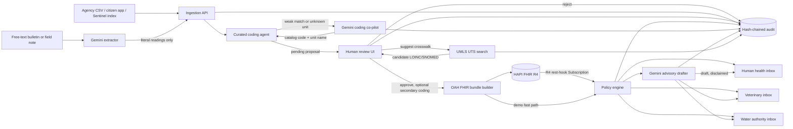

# AquaFHIR Bridge

AquaFHIR Bridge is a FHIR-native One Health data bus with a **reviewed Gemini co-pilot** and a **LOINC/SNOMED CT terminology crosswalk**. It converts heterogeneous water and Earth-observation readings — including free-text agency bulletins — into reviewed [OneAquaHealth FHIR R4](https://build.fhir.org/ig/hl7-eu/oah/) resources, publishes them to a HAPI FHIR server, evaluates an explicit alert policy, drafts audience-specific advisories, and records each transformation in a tamper-evident audit chain.

The AI is deliberately bounded, and so is the terminology assist built on top of it. Gemini decides *which curated code a messy label means*, *which measurements a note literally contains*, and *how to phrase an advisory*. The crosswalk decides only *which real LOINC/SNOMED CT concepts match this curated code's name* — validated against the published LOINC term list, and a reviewer must explicitly pick one before it is attached. Deterministic code decides *the published number*, *whether review is required* (always), *whether an alert fires*, and *what is written to FHIR*. Remove either API key and the whole pipeline still runs — both paths are tested.

This repository contains only the first concept from the source brief: **the One Health data bus and reviewed coding agent**. It does not include the separate BloomGuard prediction product or StreamSentinel symptom-surveillance concept.

> Status: detailed prototype boilerplate. It is suitable for a hackathon demonstration and engineering handoff, not clinical, veterinary, public-warning, or regulatory production use.

## Current status: done vs. pending

**Done and tested (118 offline tests, no live Gemini or UMLS call ever runs in CI):**

- Curated OAH terminology coding and reviewed unit conversion ([coding.py](src/aquafhir/coding.py))
- Gemini coding co-pilot, unstructured-bulletin intake, audience advisory drafting, grounded situation reports — all human-reviewed, all degrade cleanly with no key ([coding_llm.py](src/aquafhir/coding_llm.py), [intake.py](src/aquafhir/intake.py), [briefing.py](src/aquafhir/briefing.py))
- **Terminology crosswalk** — suggests real LOINC/SNOMED CT codes for a curated OAH code, searching the committed LOINC table locally first (finds `9481-3` pH of Water, `12530-2` Chloride in Water) and topping up from UMLS UTS; invalid UMLS results are rejected against the published term list. A reviewer explicitly attaches one at approval, and it is published as a second `Coding` on the FHIR Observation ([loinc_table.py](src/aquafhir/loinc_table.py), [terminology.py](src/aquafhir/terminology.py), [umls.py](src/aquafhir/umls.py); see [§ The terminology crosswalk](#the-terminology-crosswalk))
- **UMLS license approved** (2026-08-20) and the live UTS API verified end to end against the 2026AA release
- HAPI FHIR R4 publication against the real `hl7.eu.fhir.oah` profiles, transaction bundles, Subscription install and rest-hook processing ([fhir.py](src/aquafhir/fhir.py))
- Versioned, unit-aware threshold policy with audience routing ([thresholds.py](src/aquafhir/thresholds.py))
- SQLite-backed, hash-chained provenance for every proposal, decision, alert, and model/terminology call
- A dependency-free reviewer console — queue, ingest, alerts, and audit trail — including a UMLS suggestion picker on each pending proposal
- Docker Compose stack: bridge + HAPI + PostgreSQL, pinned image versions

**Pending — tracked honestly rather than hidden:**

- **Environmental LOINC coverage is genuinely incomplete.** LOINC has exact terms for pH, chloride, and conductivity in water, but *none* for dissolved oxygen or water temperature in an environmental specimen, and nothing for a satellite-derived index like NDCI. The crosswalk returns nothing for those rather than offering a plausible-looking wrong code, which is why the OAH IG's temporary code system exists at all. Submitting the gaps to LOINC is the real fix.
- **Crosswalk provenance detail.** Approval today hash-chains only a boolean (`reviewer_attached_secondary_coding`). A production version should hash-chain the exact query/response the same way Gemini calls already are (prompt hash, response hash, latency) — tracked in [production-checklist.md](docs/production-checklist.md).
- **SNOMED CT candidates are unvalidated.** LOINC results are checked against the published term table; SNOMED concept ids are passed through, because this repository deliberately does not vendor the SNOMED release.
- **Live Earth-observation and agency connectors.** Still replaying the transparent synthetic Oder CSV; a real Copernicus Sentinel-2 or national river-monitoring feed is the next highest-value addition (see [§ Judging-criteria mapping](#judging-criteria-mapping), Scale row).
- Everything else listed in [§ Implemented versus production work](#implemented-versus-production-work).

## Hackathon alignment

Built for the **IEEE OneAquaHealth Global Hackathon 2026**, an EU Horizon Europe–funded event that connects urban aquatic ecosystem health to human, animal, and environmental well-being through the One Health approach.

- **Track:** Track 7 — Digital Health Standards ("Enable interoperability across systems"; challenge: "Fragmented data and lack of standards"; expected tooling: "FHIR models, AI agents, and integration frameworks").
- **Track statement:** AquaFHIR Bridge *is* the interoperability layer the track asks for — it takes fragmented agency, citizen-science, and Earth-observation readings and normalizes them into the project's own [OneAquaHealth FHIR IG](https://build.fhir.org/ig/hl7-eu/oah/), then routes standards-based alerts to human-health, veterinary, and water-authority consumers.
- **Hackathon period:** September 16–30, 2026. **Judging:** October 1–15, 2026. **Winners announced:** October 24, 2026 at the IEEE iGET Conference. **Registration closes:** August 31, 2026. (Some third-party listings show slightly different dates — treat the official OneAquaHealth hackathon page as authoritative.)

### Judging-criteria mapping

| Criterion | How this repository addresses it |
|---|---|
| **Impact & Alignment with the OneAquaHealth mission** | Every environmental reading is normalized into the *same* FHIR resource model the OneAquaHealth project already publishes, and a crossed threshold routes an alert to human-health, veterinary, *and* water-authority audiences in one step — the ecosystem→health link is the product, not a bolt-on chart. |
| **Innovation & Creativity** | A working Gemini co-pilot that maps multilingual, abbreviated, and free-text source data onto OAH terminology under enum-constrained grounding, and drafts audience-specific advisories — with a hash-chained ledger recording the model id and the exact prompt hash behind every proposal (§ [The Gemini co-pilot](#the-gemini-co-pilot)). Layered on top, a **terminology crosswalk** finds the real LOINC code for the same curated OAH concept — searching the published LOINC table scoped to environmental specimens, which surfaces `9481-3` pH of Water where a generic clinical UMLS search returns *Peliosis hepatis* — so a reviewer can publish both the project-specific code and a standard one a downstream EHR already understands (§ [The terminology crosswalk](#the-terminology-crosswalk)). FHIR-for-environment bridges with reviewer gating are rare; ones that also close the "temporary code system → real terminology" gap are rarer still. |
| **Architecture** | HAPI FHIR R4 loaded with the real `hl7.eu.fhir.oah` package, R4 rest-hook Subscriptions, a versioned/unit-aware alert policy, a swappable `CodingProposer` contract the model plugs into without touching the FHIR or alerting layers, a two-source `TerminologyCrosswalk` that validates every LOINC candidate against the published term table and degrades source-by-source, and documented sequence diagrams (see [architecture.md](docs/architecture.md)). 118 tests, all offline. |
| **UX** | A dependency-free reviewer console, not a dashboard of charts. Each queue row reads *as received → OneAquaHealth FHIR*, with the model's quoted evidence, competing candidates, and a visible flag when the AI disagrees with the curated rules. Alerts carry one-click advisory drafting; the audit trail is a real table. The reviewer sees what the model saw. See the [demo script](docs/demo-script.md). |
| **Scale** | Config-driven terminology ([coding-rules.yaml](config/coding-rules.yaml)) and policy ([thresholds.yaml](config/thresholds.yaml)) — adding an indicator is a YAML edit, and the model's vocabulary widens with it automatically. `auto` assist mode spends a model call only where rules are weak, so cost scales with novelty rather than volume. Gap analysis in § [Implemented versus production work](#implemented-versus-production-work). |

### Submission checklist

| Required item | Where it lives |
|---|---|
| Track alignment statement | This section |
| Project description (problem, solution, users, impact) | This README's opening summary + [Real-world anchor](#real-world-anchor-the-2022-oder-river-disaster) |
| 3–5 minute demo video | Script in [demo-script.md](docs/demo-script.md); record against the Docker stack |
| Public code repository with documentation | This repository |
| Working prototype / proof-of-concept | `docker compose up --build` (§ [Quick start with Docker](#quick-start-with-docker)) |

## What the system proves

The end-to-end slice is intentionally narrow:

1. Accept an agency, citizen, or satellite reading — structured, or as a free-text bulletin — without discarding the original label or source.
2. Propose an OAH terminology code and normalize the unit to UCUM, using curated rules first and a grounded Gemini call only where those rules are weak.
3. Require a person to approve or reject the proposal. No confidence score, and no model, bypasses review.
4. Build and validate an OAH `Location` and environmental `Observation` against their profiles.
5. Optionally suggest a real LOINC/SNOMED CT code for the proposal's OAH concept via UMLS; a reviewer may attach one, never the other way around.
6. Publish those resources — the OAH coding, and the reviewer-attached secondary coding if any — plus the source `Organization` as one HAPI FHIR R4 transaction, or return them in dry-run mode.
7. Evaluate a versioned demonstration threshold policy — deterministically, with no model involvement — and route any alert to human-health, veterinary, and/or water-authority audiences.
8. Draft an audience-specific advisory for a routed alert, marked `draft` and disclaimed, from the facts the policy engine already established.
9. Hash-chain every proposal, decision, alert, model call, and terminology-crosswalk attachment — including the prompt hash and model id where applicable — so later modification is detectable.

The included Oder replay is synthetic demonstration data shaped around the 2022 incident narrative. It is not a scientifically reconstructed incident dataset, and the sample thresholds are not WFD/EQS limits.

### Real-world anchor: the 2022 Oder River disaster

In July–August 2022, a *Prymnesium parvum* ("golden algae") bloom — triggered by elevated salinity (linked to industrial discharges) combined with heat and low flow — killed fish and molluscs across the Poland–Germany border stretch of the Oder river. Reported figures vary by source and method: the Leibniz Institute of Freshwater Ecology and Inland Fisheries (IGB) put the toll at up to 1,000 tonnes of fish, mussels, and snails; a European Commission report cites roughly 360 tonnes as the figure scientifically confirmed; and Poland's own government reporting recorded 249 metric tonnes of dead fish physically collected within its territory between late July and 12 September 2022. IGB scientists measured algal concentrations reaching around 100,000 cells per millilitre in the river at the height of the bloom.

The bloom's spread was already visible in Copernicus Sentinel-2 imagery, and salinity/conductivity readings were already measurably elevated — but that evidence sat in fragmented Polish and German agency systems and reached downstream communities and cross-border authorities too slowly to change the outcome. AquaFHIR Bridge's Oder replay demonstrates, with clearly labeled synthetic data, how normalizing that same class of signal (conductivity, an NDCI-style bloom index, dissolved oxygen) into shared FHIR resources with a threshold policy and cross-audience Subscription alerting could plausibly compress that delay. This is presented as a *plausible earlier-warning* case, not a claim that the tool would have prevented the fish kill — the underlying pollution and ecological trigger are a policy and enforcement problem the data layer alone does not solve.

## Architecture



Gemini appears in three places and in none of them can it publish: it feeds the *proposal*
queue, it feeds the *draft* advisory queue, and every call it makes is hash-chained with
its model id and prompt hash. UMLS appears in exactly one place and cannot publish either:
it only ever offers the review UI a candidate second coding, which a reviewer must choose
to carry into the bundle builder. The policy engine and the FHIR builder never see a model
or a UMLS response directly — only what a human already decided to approve.

The prototype keeps its review queue, alerts, and provenance in SQLite. HAPI uses PostgreSQL. That separation makes the boundary clear: FHIR is the interoperable record; workflow state is application state. See [architecture.md](docs/architecture.md) for component and sequence details.

## Quick start with Docker

Requirements: Docker Engine/Desktop with Compose v2.

```bash
cp .env.example .env
# Add your keys:
#   GEMINI_API_KEY=...   (free at https://aistudio.google.com/apikey)
#   UMLS_API_KEY=...     (free at https://uts.nlm.nih.gov/uts/profile, after NLM approves
#                          your UMLS license -- typically a 3-business-day review)
docker compose up --build
```

On PowerShell, use `Copy-Item .env.example .env` instead of `cp`.

Both keys are optional and independent. Without `GEMINI_API_KEY` the bridge starts in
deterministic-only mode: the header badge reads `AI off`, curated coding and the full
FHIR/alerting pipeline work normally, and the AI endpoints return `503` with an explanation
rather than failing obscurely. Without `UMLS_API_KEY` the terminology-crosswalk badge reads
`UMLS off`, the "Suggest LOINC/SNOMED" action disappears from the review UI, and
`/api/v1/terminology/*` returns the same kind of explanatory `503` — approvals simply carry
one coding instead of two. Compose reads `.env` for substitution and passes both keys through
as environment variables; `.dockerignore` keeps `.env` out of the image so neither key is
baked into a layer.

Open:

- Dashboard: <http://localhost:8000>
- OpenAPI: <http://localhost:8000/docs>
- HAPI FHIR UI: <http://localhost:8080>
- HAPI FHIR base: <http://localhost:8080/fhir>

HAPI can take a minute or two on its first start while PostgreSQL initializes and the `hl7.eu.fhir.oah#0.1.0-ci-build` package is installed. The Compose image is pinned to HAPI `v8.10.0-3`; pin it by digest as well before a controlled deployment.

In the console's **Review queue**, choose **Load Oder replay**, inspect each terminology proposal, and approve it (or use **Approve all pending**). Three of the five readings cross the demonstration policy and create audience-specific alert cards; open **Alerts** and press **Draft for veterinary** on one to see Gemini write the advisory. The top bar shows the FHIR write mode (`enabled` vs `dry-run`), the AI mode (`gemini-2.5-flash · auto` vs `AI off`), and the terminology-crosswalk mode (`UMLS LNC/SNOMEDCT_US` vs `UMLS off`).

With `UMLS_API_KEY` set, a pending proposal also shows **Suggest LOINC/SNOMED (UMLS)**. Click it, then click a candidate chip to mark it "will attach on approval" — the next **Approve** on that card publishes an Observation with two codings: the curated OAH one and the reviewer-picked LOINC/SNOMED CT one.

To submit the harder case, use the structured form's default — the German label
`Leitfähigkeit` with unit `uS/cm`. Curated alias matching scores it at 0.31 and refuses;
the co-pilot resolves it and the reviewer still decides.

## Run the bridge locally

This path is faster for development and defaults to safe FHIR dry-run mode.

```bash
python -m venv .venv
# PowerShell: .venv\Scripts\Activate.ps1
# bash/zsh:  source .venv/bin/activate
python -m pip install -e ".[dev]"
cp .env.example .env
```

Edit `.env`:

```dotenv
DATABASE_PATH=aquafhir.db
FHIR_BASE_URL=http://localhost:8080/fhir
FHIR_WRITE_ENABLED=false
GEMINI_API_KEY=your-key-or-leave-empty
GEMINI_ASSIST_MODE=auto
UMLS_API_KEY=your-key-or-leave-empty
```

Then start and test:

```bash
uvicorn aquafhir.main:app --reload
pytest          # 118 tests, fully offline — no keys needed, no network touched
ruff check .
```

The suite never calls Gemini or UMLS. `tests/fakes.py` replaces only the HTTP hop for each,
so the schema construction, JSON parsing, hashing, and every guardrail still run for real.

## Try the API

Check what the AI layer is allowed to do:

```bash
curl http://localhost:8000/api/v1/ai/status
```

Create a review proposal. `Leitfähigkeit` is the interesting case: curated alias matching
scores it at 0.31 and refuses, so `auto` mode consults Gemini.

```bash
curl -X POST http://localhost:8000/api/v1/proposals \
  -H "Content-Type: application/json" \
  -d '{
    "source_id":"pl-agency-001",
    "source_type":"agency",
    "parameter":"Leitfähigkeit",
    "value":2350,
    "unit":"uS/cm",
    "observed_at":"2022-07-27T08:00:00Z",
    "site_code":"oder-kostrzyn",
    "site_name":"Oder at Kostrzyn",
    "latitude":52.5887,
    "longitude":14.6495
  }'
```

The response carries `proposer: "gemini-assisted"`, the OAH code, `2.35 mS/cm` computed
from the reviewed factor, and an `ai` block with the model id and prompt hash.

Extract readings from an unstructured bulletin instead:

```bash
curl -X POST http://localhost:8000/api/v1/intake \
  -H "Content-Type: application/json" \
  -d '{
    "text":"WIOŚ Szczecin, 27.07.2022 08:00 UTC — Oder at Kostrzyn. Leitfähigkeit 2350 uS/cm. Gelöster Sauerstoff 3,6 mg/L. Angler melden tote Fische — keine Messung.",
    "source_id":"wios-szczecin-bulletin",
    "default_site_code":"oder-kostrzyn",
    "default_site_name":"Oder at Kostrzyn"
  }'
```

Both paths produce `pending` proposals and warnings — never a published resource. Load the
whole synthetic Oder timeline the same way:

```bash
curl -X POST http://localhost:8000/api/v1/replay
```

The result remains `pending`, even for an exact match and even when the model is confident.
Approve it with the returned ID:

```bash
curl -X POST http://localhost:8000/api/v1/proposals/PROPOSAL_ID/approve \
  -H "Content-Type: application/json" \
  -d '{"reviewer":"reviewer@example.org"}'
```

Inspect alerts, draft an advisory for one audience, and verify the audit chain:

```bash
curl http://localhost:8000/api/v1/alerts
curl -X POST "http://localhost:8000/api/v1/alerts/ALERT_ID/briefings?audience=veterinary"
curl -X POST http://localhost:8000/api/v1/ai/situation-report
curl http://localhost:8000/api/v1/provenance/verify
```

A reviewer who disagrees with the model overrides it in the approve body:

```bash
curl -X POST http://localhost:8000/api/v1/proposals/PROPOSAL_ID/approve \
  -H "Content-Type: application/json" \
  -d '{
    "reviewer":"reviewer@example.org",
    "coding":{"system":"http://hl7.eu/fhir/ig/oah/CodeSystem/temporarySystem-oah-eu",
              "code":"chloride","display":"Chloride"},
    "normalized_value":120.0,
    "normalized_unit":"mg/L"
  }'
```

The override is recorded in the provenance payload alongside the model's prompt hash, so
the disagreement itself is auditable.

With `UMLS_API_KEY` set, ask for a real-terminology crosswalk on a pending proposal, then
carry the pick into approval as `secondary_coding`:

```bash
curl "http://localhost:8000/api/v1/proposals/PROPOSAL_ID/terminology-suggestions"

curl -X POST http://localhost:8000/api/v1/proposals/PROPOSAL_ID/approve \
  -H "Content-Type: application/json" \
  -d '{
    "reviewer":"reviewer@example.org",
    "secondary_coding":{"system":"http://loinc.org","code":"11556-8","display":"Dissolved oxygen"}
  }'
```

The resulting Observation carries both codings in `code.coding`: the curated OAH one first,
the reviewer-attached LOINC/SNOMED CT one second. Without a key, the suggestions endpoint
returns `503` and approval works exactly as before, with one coding.

See [api.md](docs/api.md) for every endpoint and error contract.

## FHIR conformance choices

The current OAH continuous build is based on FHIR 4.0.1. Its environmental Observation profile requires:

- `status = final`;
- a code drawn preferably from the OAH non-health indicator value set;
- a `subject` referencing an OAH `Location`;
- an `effective[x]` time;
- at least one `performer`;
- a quantity or coded value.

The builder therefore creates all required surrounding resources, uses `http://unitsofmeasure.org` for quantity codes, and places this canonical profile URL in `Observation.meta.profile`:

```text
http://hl7.eu/fhir/ig/oah/StructureDefinition/observation-indicators-oah
```

The OAH IG currently carries environmental concepts such as `electrical-conductivity`, `dissolved-oxygen`, `waterTemperature`, and `ndci` in its temporary project code system. The scaffold uses those codes rather than inventing unsupported LOINC mappings.

A second coding is now supported, but only after terminology review by a person: the crosswalk (§ [The terminology crosswalk](#the-terminology-crosswalk)) suggests a real LOINC/SNOMED CT candidate for the curated code's display text, and `Observation.code.coding` only ever gains a second entry when a reviewer supplies `ReviewDecision.secondary_coding` at approval time — never automatically.

FHIR R4 Subscription filtering is search-based, not threshold-expression based. The supplied Subscription watches final Observations and sends an empty rest-hook notification; the bridge then queries HAPI for resources updated since its durable cursor and applies the versioned numerical policy. The approval pipeline also evaluates the same policy immediately to keep the demo deterministic.

## The Gemini co-pilot

Real environmental feeds do not say `electrical conductivity`. They say `EC_uScm`,
`Leitfähigkeit`, `przewodność`, `cond. (25C)` — or they say it in a paragraph of a
voivodeship bulletin. Alias similarity fails on all of those. A language model does not.
But a language model must never be trusted with the parts that decide what gets published.

### The split, enforced in code

| Gemini may decide | Deterministic code decides |
|---|---|
| Which catalog code a messy label denotes | The code's display text, read from the YAML |
| Which known unit string a source unit denotes | The conversion factor and the published number |
| Which measurements a free-text note literally contains | Whether review is required — always yes |
| How to phrase an advisory for one audience | Whether an alert fires, at what severity, to whom |
| | What is written to FHIR |

Three guardrails hold it:

1. **Closed vocabulary.** The curated catalog is injected into the prompt, the
   `responseSchema` constrains `code` to an enum of exactly those codes plus `NO_MATCH`,
   and [`coding_llm.py`](src/aquafhir/coding_llm.py) re-checks the returned code against
   the catalog anyway. A schema is a request, not a proof. An out-of-catalog code is
   discarded and the curated proposal stands.
2. **No model arithmetic.** The model may say *"this `uS/cm` string denotes the `uS/cm`
   unit"*. The factor and the multiplication live in
   `ReviewedCodingAgent.normalize_unit`, from reviewed YAML. The prompt never contains the
   converted value, so the model cannot anchor on the answer — there is a test asserting
   exactly that.
3. **Capped confidence.** Any AI-influenced proposal is capped at
   `GEMINI_CONFIDENCE_CEILING` (0.95). A disagreement with the curated match, or a
   model-raised expert-review flag, caps it at 0.80 and surfaces a warning on the card.
   No value publishes anything; `requires_review` is unconditional.

### Four wired features

| Feature | Endpoint | What the model is allowed to return |
|---|---|---|
| Terminology coding co-pilot | `POST /api/v1/proposals` | One catalog code, one known unit name, evidence, confidence |
| Unstructured intake | `POST /api/v1/intake` | Measurements literally present in the note, plus warnings |
| Audience advisory drafting | `POST /api/v1/alerts/{id}/briefings` | Prose for one already-decided alert, marked `draft` |
| Grounded situation report | `POST /api/v1/ai/situation-report` | A summary of this bridge's own stored records only |

### Provenance for model calls

Every call records provider, model id, versioned prompt-template id, SHA-256 of the exact
rendered prompt, SHA-256 of the response, latency, the grounded code list, and the model's
quoted evidence. Approval and rejection events carry the prompt hash into the hash chain,
so an auditor can distinguish a prompt-template change from an input change months later.

### Failure is a degradation, not an outage

An unreachable, rate-limited, blocked, truncated, or out-of-catalog response falls back to
the curated proposal with a note in the rationale. A missing key disables the AI features
and leaves the rest untouched. Both paths are covered by tests, and the transport tests
cover 429 retry, 401 non-retry, network error retry, and a model that rejects
`thinkingConfig`.

Prompt templates live in [prompts.py](src/aquafhir/prompts.py). The curated vocabulary is
in [coding-rules.yaml](config/coding-rules.yaml). Demonstration alert rules live separately
in [thresholds.yaml](config/thresholds.yaml), which prevents a terminology edit — or a
model — from silently changing safety policy.

## The terminology crosswalk

The OAH IG's environmental concepts live in a temporary project code system
(`http://hl7.eu/fhir/ig/oah/CodeSystem/temporarySystem-oah-eu`) — reasonable for a
continuous-build IG, but a downstream hospital or public-health system will not have that
code system loaded. It will have LOINC and SNOMED CT. The crosswalk closes that gap by
offering the real-world code for a curated OAH concept, for a reviewer to accept or ignore.

### Why a plain UMLS search is not enough

The obvious implementation — ask the UMLS Metathesaurus for the curated code's display text —
does not work, and it fails in two distinct ways that are worth stating because both are
easy to ship without noticing.

**It returns codes that are not LOINC codes.** A `sabs=LNC` search also returns LOINC *Parts*
(`LP14752-7`) and Metathesaurus-internal identifiers (`MTHU001949`) minted where a concept has
no source-asserted code. Neither exists in the published LOINC table, so publishing one under
`system = http://loinc.org` asserts a code that is not real. A reviewer cannot be expected to
know that by sight, so [`loinc_table.py`](src/aquafhir/loinc_table.py) checks every LOINC
candidate against the published term list and drops the rest.

**It ranks clinically.** UMLS has no idea the subject is a river. Asking it for `pH` returns
*pH measurement* and *Peliosis hepatis* well above anything about water; `Water temperature`
returns *Checking bath water temperature*; `Electrical conductivity` returns *Skin electrical
conductivity meter*. Every one of those would be wrong to publish.

Meanwhile LOINC itself already carries the right answers. Scoping the search to environmental
specimens finds them immediately:

| OAH concept | LOINC code found locally | What plain UMLS search ranked first |
|---|---|---|
| `ph` | **9481-3** — pH of Water | *Peliosis hepatis* |
| `chloride` | **12530-2** — Chloride [Moles/volume] in Water | *Sodium chloride* |
| `electrical-conductivity` | **87444-6** — Electron [Electrical Conductivity] of Water | *Skin electrical conductivity meter* |
| `dissolved-oxygen` | *(none — genuine gap)* | *Dissolved oxygen meter, battery-powered* |
| `waterTemperature` | *(none — genuine gap)* | *Checking bath water temperature* |

So the crosswalk searches the committed LOINC table first and uses UMLS to top up the
remainder — chiefly SNOMED CT, which this repository does not vendor. The local path needs no
key and no network.

The two blank rows are not a bug to paper over. Environmental LOINC genuinely has no term for
dissolved oxygen or water temperature in water, and none for a satellite index like NDCI. The
crosswalk returns nothing rather than a plausible-looking wrong code — which is precisely why
the OAH IG needs a temporary code system in the first place.

### Authentication, done the way NLM actually documents it

The UMLS Terminology Services (UTS) REST API authenticates with a single `apiKey` query
parameter issued from a UTS profile
(<https://documentation.uts.nlm.nih.gov/rest/authentication.html>) — the older
ticket-granting-ticket flow is deprecated, and there is **no OAuth2 client_id/client_secret
grant** for this API as of 2026. [`umls.py`](src/aquafhir/umls.py) implements exactly that
scheme. A client_id/client_secret pair from an app registration made while *requesting* the
license will not authenticate against `uts-ws.nlm.nih.gov`; use the API key from your UTS
profile.

### The split, enforced in code

| The crosswalk may suggest | Deterministic code / a human decides |
|---|---|
| Which real LOINC/SNOMED CT concepts match this OAH code's display text | Whether that suggestion is ever attached to a proposal (`ReviewDecision.secondary_coding`) |
| A ranked list of candidates, scored only by name similarity | The published OAH coding, the quantity, and whether the alert fires — none of which the crosswalk can see or touch |

Guardrails mirror `coding_llm.py`'s posture:

1. **Codes are validated, not trusted.** Every LOINC candidate must appear in the published
   term table. `UMLS_VOCABULARIES` (default `LNC,SNOMEDCT_US`) is sent as the UTS `sabs`
   filter *and* re-checked against every result — a request is not a proof. Only `ACTIVE`
   terms are suggested, though a deprecated code still validates, because it was legitimately
   published.
2. **Specimen scope is an allowlist.** Local search covers exactly `Water`, `Air`, `Envir`,
   and `Environmental specimen`. Not a substring test — LOINC's `Airway adaptor` and
   `Airway.proximal` are respiratory-device systems, not air quality.
3. **Suggestion only, never selection.** `suggest_terminology()` is read-only. Nothing is
   written to a proposal, let alone to FHIR, until a reviewer supplies a `Coding` explicitly.
4. **Independent failure domains.** A UMLS outage degrades to the local LOINC results. A
   UMLS failure with *no* local results is surfaced as a `502` rather than an empty list, so a
   reviewer is never told "no match" when the truth is "the lookup broke". A missing LOINC
   table disables local search and validation with a warning, and never blocks startup.

### Two wired surfaces

| Feature | Endpoint | What it returns |
|---|---|---|
| Terminology status | `GET /api/v1/terminology/status` | Which sources are live (`loinc-table`, `umls`) and which vocabularies are searched |
| Crosswalk suggestions | `GET /api/v1/proposals/{id}/terminology-suggestions` | Up to 5 candidate `TerminologyMatch` objects (`system`, `code`, `display`, `vocabulary`, `score`), local environmental LOINC first |

`ReviewDecision.secondary_coding` carries a chosen candidate into `POST
.../proposals/{id}/approve`; `build_resources()` in [fhir.py](src/aquafhir/fhir.py) appends it
as a second entry in `Observation.code.coding`, and the approval provenance entry records
`reviewer_attached_secondary_coding: true`.

## Repository map

```text
.
├── config/                    # reviewed terminology and demo alert policy
├── data/                      # transparent synthetic Oder replay CSV
├── docs/                      # architecture, API, demo, production notes
├── infra/hapi/               # HAPI R4 + OAH package configuration
├── src/aquafhir/
│   ├── coding.py             # curated proposer + the catalog the model is grounded in
│   ├── coding_llm.py         # Gemini coding co-pilot and its guardrails
│   ├── gemini.py             # minimal Generative Language REST client
│   ├── prompts.py            # versioned prompt templates and response schemas
│   ├── intake.py             # free text -> literal readings -> pending proposals
│   ├── briefing.py           # audience advisories and grounded situation reports
│   ├── loinc_table.py        # published LOINC terms: validation + environmental search
│   ├── umls.py               # minimal UMLS UTS REST client (apiKey auth)
│   ├── terminology.py        # local LOINC first, UMLS top-up, into suggested codings
│   ├── fhir.py               # conformant resources, bundles, subscriptions
│   ├── repository.py         # SQLite workflow state + hash chain
│   ├── service.py            # review-gated orchestration
│   ├── thresholds.py         # unit-aware versioned policy evaluation
│   ├── main.py               # FastAPI surface
│   └── static/               # dependency-free reviewer console (no build step)
├── tests/                    # coding, AI guardrail, terminology, transport, policy, audit tests
├── compose.yaml              # bridge + HAPI + PostgreSQL
└── Dockerfile
```

## Implemented versus production work

| Capability | In this scaffold | Required before real deployment |
|---|---|---|
| Ingestion | Typed JSON API and transparent replay CSV | Authenticated connectors, source schemas, retries, dead-letter queue |
| Coding | Curated proposals, unit conversion, and a grounded Gemini co-pilot | Labelled model evaluation set, reviewer roles, dual control |
| Terminology crosswalk | UMLS UTS search suggesting real LOINC/SNOMED CT candidates, vocabulary allowlist re-check, reviewer-gated attachment, tested no-key fallback | UMLS license approved (requested; NLM review pending), full query/response provenance hashing to match Gemini's, coverage beyond `LNC`/`SNOMEDCT_US`, cached lookups |
| AI governance | Prompt versioning, prompt/response hashing, capped confidence, catalog re-check, tested no-key fallback | Evaluation metrics published per release, over-trust sampling, prompt-injection tests, quota and circuit breaker, DPIA for the provider transfer |
| FHIR | OAH R4 resources and transaction publication | CI validation with the exact frozen IG package, server capability checks |
| Alerting | Unit-aware YAML policy and audience tags | Approved jurisdiction policy, suppression, escalation, delivery receipts |
| Subscription | R4 rest-hook creation endpoint | Public TLS callback, rotation, replay protection, network allowlist |
| Provenance | Local SHA-256 hash chain | Signed checkpoints/WORM storage and FHIR `Provenance` resources |
| Security | Shared-secret webhook example | OIDC/SMART, RBAC, secret manager, encryption, audit export, threat review |
| Operations | Health endpoint, container stack, CI | Metrics, tracing, backups, SLOs, disaster recovery, runbooks |

The detailed hardening gates are in [production-checklist.md](docs/production-checklist.md).

## Configuration

| Variable | Default | Purpose |
|---|---|---|
| `DATABASE_PATH` | `aquafhir.db` | Bridge workflow SQLite file |
| `FHIR_BASE_URL` | `http://localhost:8080/fhir` | HAPI R4 endpoint |
| `FHIR_WRITE_ENABLED` | `false` | Enables external FHIR mutation only when explicit |
| `FHIR_TIMEOUT_SECONDS` | `15` | HAPI request timeout |
| `REVIEW_CONFIDENCE_THRESHOLD` | `0.90` | UI/routing signal; never auto-approves |
| `WEBHOOK_SHARED_SECRET` | local demo value | Validates example Subscription callbacks |
| `CODING_RULES_PATH` | `config/coding-rules.yaml` | Curated mapping catalog |
| `THRESHOLDS_PATH` | `config/thresholds.yaml` | Versioned alert policy |
| `REPLAY_DATA_PATH` | `data/oder-replay.csv` | Synthetic replay dataset |
| `GEMINI_API_KEY` | *(empty)* | Enables the co-pilot. Empty is a supported, tested mode |
| `GEMINI_MODEL` | `gemini-2.5-flash` | Pin explicitly; recorded on every proposal |
| `GEMINI_ASSIST_MODE` | `auto` | `off`, `auto` (only where rules are weak), or `always` |
| `GEMINI_ASSIST_BELOW_CONFIDENCE` | `0.95` | `auto` consults the model below this curated confidence |
| `GEMINI_CONFIDENCE_CEILING` | `0.95` | Hard cap on any AI-influenced confidence |
| `GEMINI_TIMEOUT_SECONDS` | `30` | Per-call timeout |
| `GEMINI_MAX_OUTPUT_TOKENS` | `2048` | Truncated responses are rejected, never half-parsed |
| `GEMINI_MAX_RETRIES` | `2` | Retries only 408/429/5xx and network errors |
| `GEMINI_THINKING_BUDGET` | `0` | `0` for latency; `-1` omits the field for models that reject it |
| `LOINC_TABLE_PATH` | `loinc/LoincTableCore/LoincTableCore.csv` | Published LOINC terms: local environmental search, and validation of UMLS LOINC hits. Missing file disables both with a warning |
| `UMLS_API_KEY` | *(empty)* | Adds UMLS top-up (notably SNOMED CT). Empty is a supported, tested mode — local LOINC search still works. This is a UTS **apiKey**, not an OAuth2 client_id/client_secret |
| `UMLS_API_BASE` | `https://uts-ws.nlm.nih.gov/rest` | UTS REST API base |
| `UMLS_TIMEOUT_SECONDS` | `15` | Per-call timeout |
| `UMLS_MAX_RETRIES` | `2` | Retries only 408/429/5xx and network errors |
| `UMLS_VOCABULARIES` | `LNC,SNOMEDCT_US` | Comma-separated UMLS source-vocabulary abbreviations searched and allowlist-checked |

## Source standards

- [OneAquaHealth FHIR IG continuous build](https://build.fhir.org/ig/hl7-eu/oah/)
- [OAH artifacts and profiles](https://build.fhir.org/ig/hl7-eu/oah/artifacts.html)
- [OAH package download](https://build.fhir.org/ig/hl7-eu/oah/downloads.html)
- [FHIR R4 Subscription](https://hl7.org/fhir/R4/subscription.html)
- [HAPI FHIR JPA starter](https://github.com/hapifhir/hapi-fhir-jpaserver-starter)
- [UMLS Terminology Services (UTS) REST API authentication](https://documentation.uts.nlm.nih.gov/rest/authentication.html)
- [UMLS UTS Search API reference](https://documentation.uts.nlm.nih.gov/rest/search/)
- [LOINC](https://loinc.org/) · [SNOMED CT (SNOMED International)](https://www.snomed.org/)

The OAH guide is an unauthorised, changing continuous build. Freeze and archive the exact NPM package used by a release; never assume `0.1.0-ci-build` is immutable merely because the version string stays the same.
