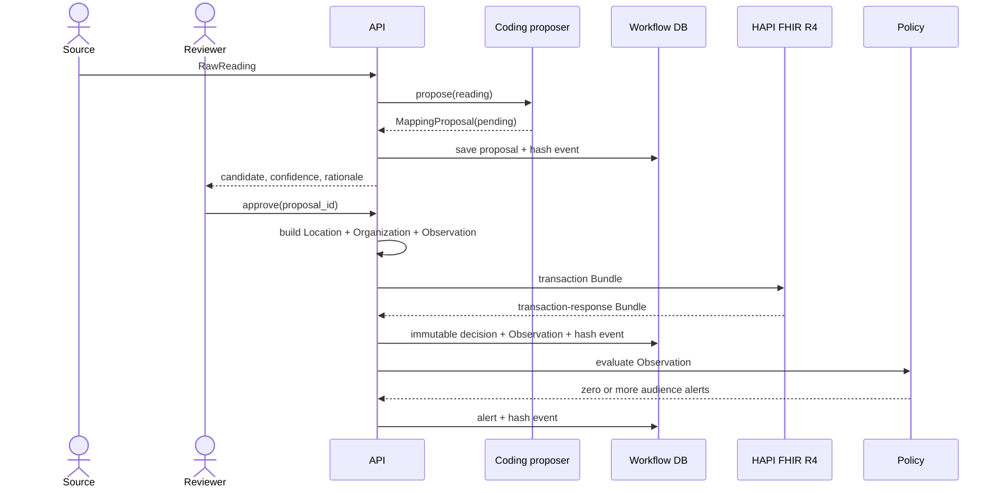

# Architecture

## System boundary

AquaFHIR Bridge owns environmental ingestion, terminology review, OAH resource construction, threshold evaluation, and delivery intent. It does not diagnose disease, predict bloom biology, replace a regulator, or send a public warning autonomously.

| Component | Responsibility | Persistent data |
|---|---|---|
| FastAPI edge | Validate requests and expose review/webhook APIs | None |
| Coding proposer | Suggest a curated OAH code and UCUM normalization | Versioned YAML |
| Review workflow | Enforce pending → approved/rejected state transition | SQLite |
| FHIR builder/client | Build atomic R4 transactions and publish to HAPI | HAPI/PostgreSQL |
| Policy engine | Compare like-for-like code, value, and unit | Versioned YAML |
| Provenance ledger | Hash-chain material state changes | SQLite |
| Dashboard | Give a reviewer a small, inspectable work surface | None |

## Approval sequence

Publication happens before the local approval commit. If HAPI rejects the transaction, the proposal remains pending and can be corrected. Repeating an approval after success returns `409 Conflict`.

## Subscription sequence

FHIR R4 Subscription criteria use resource search syntax. They cannot express a comparison such as conductivity ≥ 2.0 mS/cm. The installed subscription therefore watches final Observation changes and sends an empty POST to `/api/v1/webhooks/fhir`. The bridge uses a durable cursor to query HAPI for recently updated Observations, then evaluates the numerical policy.

For the single-node demo, approval also calls the policy engine directly. In a deployment, choose one event path and add idempotency to avoid duplicate delivery. Alert IDs are already deterministic for `(Observation, policy, rule)` and the repository ignores duplicate inserts, but provenance notification duplication should also be suppressed.

## Failure behavior

- Unknown parameter: proposal is created without a code and cannot be approved until a reviewer supplies one.
- Unknown unit: code may be proposed, but normalized quantity is absent and approval is blocked.
- HAPI unavailable or validation failure: request fails and proposal stays pending.
- Threshold unit mismatch: rule is not evaluated; no implicit conversion occurs in the policy engine.
- Repeated decision: rejected with `409`.
- Modified provenance row: chain verification reports the first invalid sequence.

## Scaling path

Replace synchronous publication with an outbox only when the semantics are explicit: the reviewed decision and outbox record must commit atomically, the publisher must be idempotent, and alert processing must key off the committed FHIR version. Move SQLite workflow tables to PostgreSQL, retain a separate schema from HAPI, and use a queue for connectors. Do not make the FHIR server the workflow engine.
