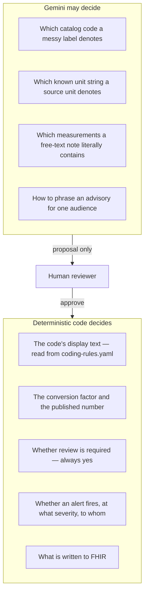
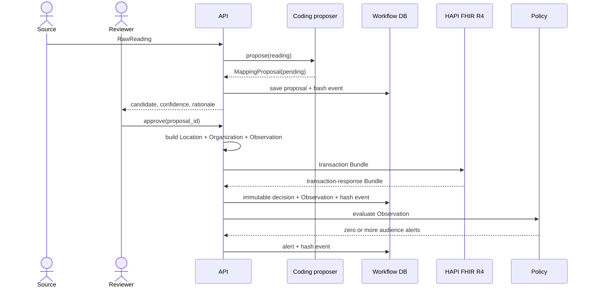

# Architecture

## System boundary

AquaFHIR Bridge owns environmental ingestion, terminology review, OAH resource construction, threshold evaluation, and delivery intent. It does not diagnose disease, predict bloom biology, replace a regulator, or send a public warning autonomously.

| Component | Responsibility | Persistent data |
|---|---|---|
| FastAPI edge | Validate requests and expose review/webhook APIs | None |
| Coding proposer | Suggest a curated OAH code and UCUM normalization | Versioned YAML |
| Gemini co-pilot | Propose a catalog code for a label rules cannot match; extract readings from free text; draft advisories | Versioned prompt templates |
| Terminology crosswalk | Suggest a real LOINC/SNOMED CT candidate for a curated OAH code's display text; never selects it | Published LOINC table (read-only) |
| Review workflow | Enforce pending → approved/rejected state transition; a reviewer may also attach a suggested secondary coding | SQLite |
| FHIR builder/client | Build atomic R4 transactions and publish to HAPI | HAPI/PostgreSQL |
| Policy engine | Compare like-for-like code, value, and unit | Versioned YAML |
| Provenance ledger | Hash-chain material state changes | SQLite |
| Dashboard | Give a reviewer a small, inspectable work surface | None |

## Where the model sits

The AI layer is deliberately bounded. It is wide enough to solve the real problem —
source labels are multilingual, abbreviated, and often not tabular at all — and narrow
enough that no model output can reach a published resource unreviewed.



Three guardrails enforce the split in code:

1. **Closed vocabulary.** The catalog is injected into the prompt, the response schema
   constrains `code` to an enum of exactly those codes plus `NO_MATCH`, and
   `coding_llm.py` re-checks the returned code against the catalog anyway. A schema is a
   request, not a proof.
2. **No model arithmetic.** The model may say "this `uS/cm` string means the `uS/cm` unit".
   The factor and the multiplication live in `ReviewedCodingAgent.normalize_unit`. The
   prompt never contains the converted value, so the model cannot anchor on the answer.
3. **Capped confidence.** Any AI-influenced proposal is capped at
   `GEMINI_CONFIDENCE_CEILING` (0.95), and a disagreement with the curated match or a
   model-raised expert-review flag caps it at 0.80. Nothing can present itself as safe to
   publish unattended.

Failure is a degradation, not an outage: an unreachable, misconfigured, rate-limited, or
out-of-catalog response falls back to the curated proposal with a note in the rationale.
The pipeline's tests cover that path.

The terminology crosswalk is a separate, narrower assist with its own failure domains. It
searches the published LOINC table locally first — scoped to environmental specimens, which
is what actually finds `9481-3` pH of Water where a generic clinical UMLS query returns
*Peliosis hepatis* — then tops up from UMLS, which authenticates with the single `apiKey`
query parameter the UTS REST API documents
(https://documentation.uts.nlm.nih.gov/rest/authentication.html). Every LOINC candidate is
validated against the published term table, because UMLS also returns LOINC Parts and
Metathesaurus ids that are not publishable LOINC codes. It only ever returns *candidates*,
and nothing is written to a proposal — let alone to FHIR — until a reviewer supplies one
explicitly as `secondary_coding` at approval. Neither a missing LOINC table nor an
unreachable UMLS ever blocks curated OAH coding, FHIR publication, or alerting.

## Proposal sequence with the co-pilot

```mermaid
sequenceDiagram
    actor Source
    actor Reviewer
    participant API
    participant Rules as Curated catalog
    participant Gemini
    participant DB as Workflow DB

    Source->>API: RawReading("Leitfähigkeit", 2350, "uS/cm")
    API->>Rules: rank aliases
    Rules-->>API: best score 0.31 — below the floor
    API->>Gemini: catalog + label + unit, enum-constrained schema
    Gemini-->>API: code=electrical-conductivity, unit=uS/cm, evidence
    API->>Rules: re-check code is in catalog; convert 2350 uS/cm
    Rules-->>API: 2.35 mS/cm using the reviewed factor
    API->>DB: pending proposal + prompt/response hashes
    API-->>Reviewer: candidate, evidence, model id, disagreement flag
    Reviewer->>API: approve
    Note over API,DB: publication path is unchanged from here on
```


## Approval sequence



Publication happens before the local approval commit. If HAPI rejects the transaction, the proposal remains pending and can be corrected. Repeating an approval after success returns `409 Conflict`.

## Subscription sequence

FHIR R4 Subscription criteria use resource search syntax. They cannot express a comparison such as conductivity ≥ 2.0 mS/cm. The installed subscription therefore watches final Observation changes and sends an empty POST to `/api/v1/webhooks/fhir`. The bridge uses a durable cursor to query HAPI for recently updated Observations, then evaluates the numerical policy.

For the single-node demo, approval also calls the policy engine directly. In a deployment, choose one event path and add idempotency to avoid duplicate delivery. Alert IDs are already deterministic for `(Observation, policy, rule)` and the repository ignores duplicate inserts, but provenance notification duplication should also be suppressed.

## Failure behavior

- Unknown parameter: proposal is created without a code and cannot be approved until a reviewer supplies one.
- Unknown unit: code may be proposed, but normalized quantity is absent and approval is blocked.
- HAPI unavailable or validation failure: request fails and proposal stays pending.
- Threshold unit mismatch: rule is not evaluated; no implicit conversion occurs in the policy engine.
- Repeated decision: rejected with `409`.
- Modified provenance row: chain verification reports the first invalid sequence.
- Gemini unreachable, rate-limited, blocked, or truncated: the curated proposal is returned with an explanatory note; AI-only endpoints return `503` (no key) or `502` (upstream failure).
- Gemini returns a code outside the catalog: the response is discarded and the curated proposal stands.
- Gemini returns `NO_MATCH`: no code is proposed and the reviewer must supply one or reject.
- UMLS unreachable or rate-limited: local LOINC results are returned alone; only if there are none does the failure surface as `502`, so a reviewer is never shown "no match" when the lookup actually broke.
- UMLS keyless: local environmental LOINC search still answers; SNOMED CT candidates are simply unavailable. `503` only when the LOINC table is missing too.
- LOINC table missing or unreadable: local search and LOINC validation are disabled with a warning; startup is never blocked.
- UMLS returns a LOINC Part (`LP...`) or Metathesaurus id (`MTHU...`): dropped, because it is not a publishable LOINC code.
- UMLS returns a vocabulary outside `UMLS_VOCABULARIES`: the result is dropped before it reaches the reviewer, re-checked in `terminology.py` regardless of what the `sabs` search filter already requested.

## Scaling path

Replace synchronous publication with an outbox only when the semantics are explicit: the reviewed decision and outbox record must commit atomically, the publisher must be idempotent, and alert processing must key off the committed FHIR version. Move SQLite workflow tables to PostgreSQL, retain a separate schema from HAPI, and use a queue for connectors. Do not make the FHIR server the workflow engine.
